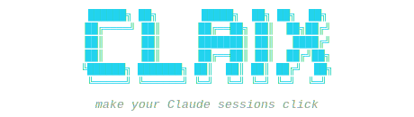

<p align="center">
  
</p>

<p align="center">
  <a href="https://github.com/sayantanghosh-in/claix">github.com/sayantanghosh-in/claix</a> &middot; <a href="https://sayantanghosh.in">sayantanghosh.in</a>
</p>

<p align="center">
  <a href="https://github.com/sayantanghosh-in/claix/releases"></a>
  <a href="https://github.com/sayantanghosh-in/claix/actions"></a>
  
  <a href="LICENSE"></a>
  
  <a href="https://github.com/sayantanghosh-in/claix/releases"></a>
</p>

---

A terminal UI to search, organize, and resume your [Claude Code](https://docs.anthropic.com/en/docs/claude-code) sessions across all your projects. Never lose a conversation again.

<p align="center">
  
</p>

<p align="center">
  <a href="docs/md/code/USAGE.md#search">Search</a> &middot; <a href="docs/md/code/USAGE.md#tags--notes">Tags</a> &middot; <a href="docs/md/code/USAGE.md#themes">Themes</a> &middot; <a href="docs/md/code/USAGE.md#cli-commands">CLI</a> &middot; <a href="docs/md/code/USAGE.md#session-init">Init</a>
</p>

---

## Install

### Homebrew

```bash
brew install sayantanghosh-in/tap/claix
```

### Go

```bash
go install github.com/sayantanghosh-in/claix@latest
```

### Binary

Download from [GitHub Releases](https://github.com/sayantanghosh-in/claix/releases).

> **macOS users:** If you see "cannot be opened because the developer cannot be verified", run:
> `xattr -d com.apple.quarantine $(which claix)`.
> This is not needed with `go install` (builds from source).

---

## Get Started

```bash
claix
```

On first launch, claix asks to set up auto-sync hooks (press Enter). That's it.

Browse sessions with `↑`/`↓`, press `Enter` to resume any session in the right project directory.

---

## What It Does

| | |
|---|---|
| **Session Discovery** | Scans and indexes all Claude Code sessions across every project |
| **Smart Titles** | Auto-generated from PRs, Claude's responses, or your first message |
| **Fuzzy Search** | `/` to filter by title, branch, project, or tags in real-time |
| **One-Key Resume** | `Enter` opens Claude Code in the correct directory |
| **Tags & Notes** | `t` to tag, `x` to untag, `n` to add notes |
| **Clickable PR Links** | Terminal hyperlinks — click to open GitHub PRs |
| **Dashboard** | Activity sparkline, token usage, top projects |
| **6 Themes** | default, dracula, catppuccin, nord, gruvbox, tokyonight |
| **Session Init** | `claix init` to pre-tag sessions before starting |
| **CLI Tools** | `list`, `search`, `stats`, `export`, `sync`, `theme` |
| **MCP Server** | Claude can tag and query sessions mid-conversation |
| **Cross-Platform** | Single binary, no runtime dependencies |

---

## Documentation

| Doc | Description |
|-----|-------------|
| [Usage Guide](docs/md/code/USAGE.md) | Keyboard shortcuts, search, tags, themes, CLI commands, MCP, troubleshooting |
| [How It Works](docs/md/code/HOW-IT-WORKS.md) | Data flow, session parsing, dashboard explained |
| [Architecture](docs/md/code/ARCHITECTURE.md) | System design and component overview |
| [Development](docs/md/code/DEVELOPMENT.md) | Dev setup, building, testing, releasing |
| [Contributing](docs/md/project/CONTRIBUTING.md) | Contribution guidelines |

---

## Roadmap

- [x] Session scanner and metadata extraction
- [x] Interactive TUI with 2-column layout
- [x] Dashboard (stats, sparkline, top projects, token usage)
- [x] Auto-generated session titles
- [x] Fuzzy search (TUI + CLI)
- [x] Session tagging and notes
- [x] One-key resume
- [x] Auto-sync via Claude Code hooks
- [x] Clickable PR links (OSC 8)
- [x] File activity tracking
- [x] Markdown export
- [x] MCP server
- [x] Cross-platform distribution (GoReleaser + Homebrew)
- [x] Custom themes
- [x] Session init
- [x] Dynamic card heights with word wrapping
- [ ] Multi-machine sync
- [ ] Session grouping / folders
- [ ] Session diff viewer

---

## Contributing

Contributions are welcome! See [CONTRIBUTING.md](docs/md/project/CONTRIBUTING.md) for guidelines.

This project follows the [Contributor Covenant Code of Conduct](https://www.contributor-covenant.org/version/2/1/code_of_conduct/).

---

## License

[MIT](LICENSE)

---

<p align="center">
  <i>"CLI + AI + X — everything just clicks."</i>
  <br><br>
  Built by <a href="https://github.com/sayantanghosh-in">Sayantan Ghosh</a>
  <br>
  If claix helps you, consider giving it a <a href="https://github.com/sayantanghosh-in/claix">star</a>
</p>
