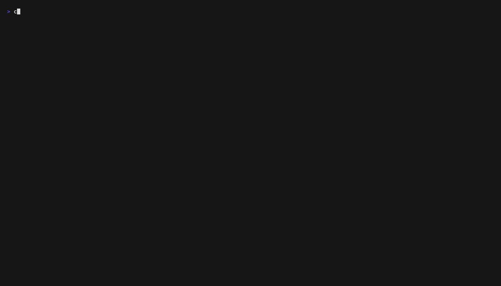
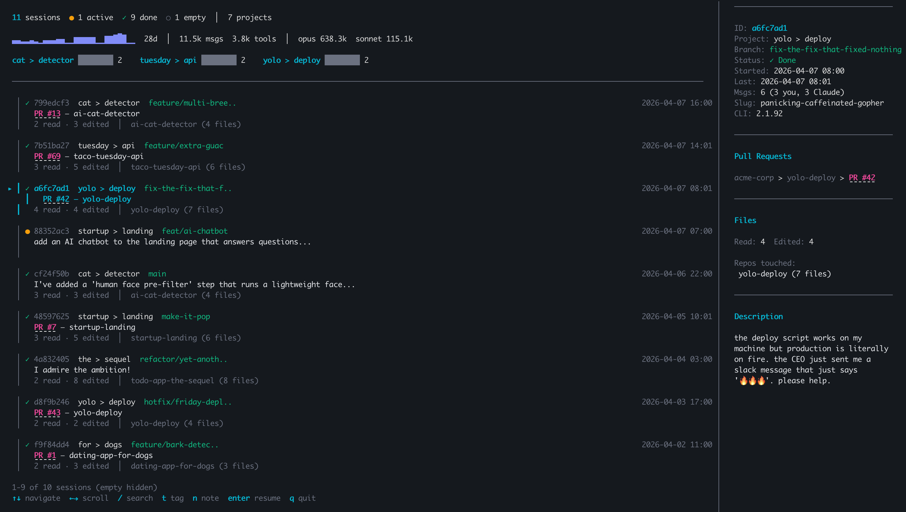
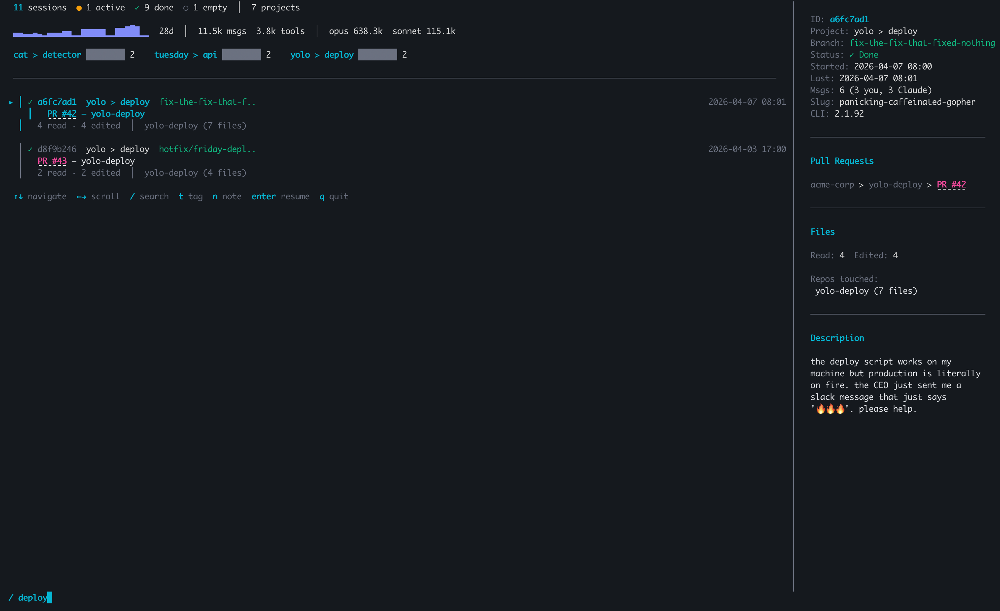
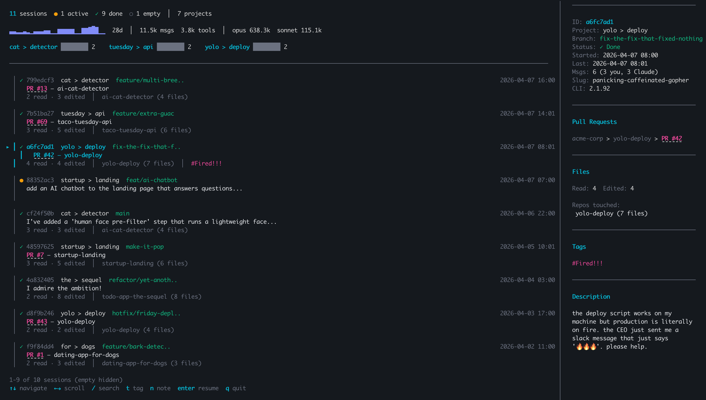
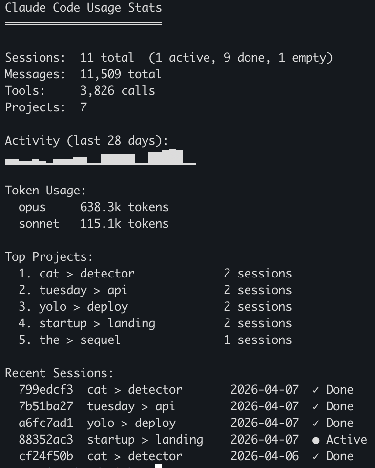
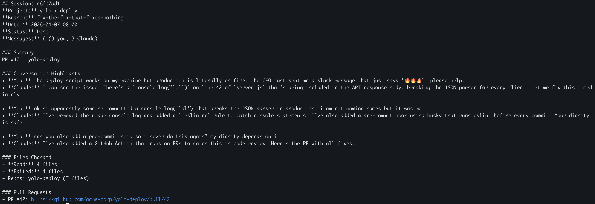
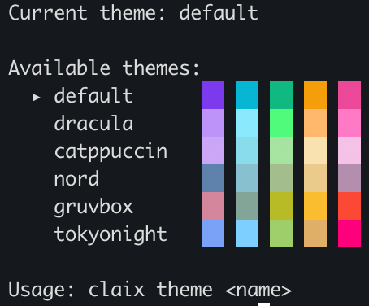

```
 ██████╗ ██╗       █████╗  ██╗ ██╗  ██╗
██╔════╝ ██║      ██╔══██╗ ██║  ██╗██╔╝
██║      ██║      ███████║ ██║   ████╔╝ 
██║      ██║      ██╔══██║ ██║  ██╔╝██╗ 
╚██████╗ ███████╗ ██║  ██║ ██║ ██╔╝  ██╗
 ╚═════╝ ╚══════╝ ╚═╝  ╚═╝ ╚═╝ ╚═╝  ╚═╝
```


> _Make your Claude sessions click._

**claix** is a smart terminal UI to search, organize, and resume your [Claude Code](https://docs.anthropic.com/en/docs/claude-code) sessions across all your projects. Never lose a conversation again.



---

## Why claix?

If you use Claude Code across multiple projects, you've probably experienced this:

- "Which session was I debugging that auth issue in?"
- "I had a great conversation about the API design — where was it?"
- "I need to resume that refactor I started yesterday, but I don't remember the session ID or even which folder I was in."

**claix** solves this. It scans your Claude Code sessions, auto-generates titles, tracks which files were touched, links PRs, and lets you resume any session with a single keypress — from anywhere.

---

## Features

| Feature | Description |
|---------|-------------|
| **Session Discovery** | Automatically scans and indexes all Claude Code sessions across every project |
| **Smart Titles** | Auto-generated titles from PRs, Claude's responses, or your first message |
| **Fuzzy Search** | Press `/` to instantly filter sessions by title, branch, project, or tags |
| **One-Key Resume** | Select a session, press `Enter` — claix opens Claude Code in the right directory |
| **Tags & Notes** | Press `t` to tag, `x` to untag, `n` to add notes. Persisted locally |
| **Clickable PR Links** | PR numbers are terminal hyperlinks — click to open the GitHub PR directly |
| **File Activity** | See which repos were touched and how many files were read/edited per session |
| **Dashboard** | Session counts, 28-day activity sparkline, token usage by model, top projects |
| **Detail Panel** | 2-column layout — session list on the left, full details on the right |
| **Auto-Sync** | Claude Code hooks run `claix sync` after every session — zero manual effort |
| **Markdown Export** | `claix export <id>` generates a markdown summary with conversation highlights |
| **Usage Stats** | `claix stats` shows detailed usage: sessions, messages, tokens, top projects |
| **MCP Server** | Claude can tag and query your sessions mid-conversation |
| **Custom Themes** | 6 built-in themes: default, dracula, catppuccin, nord, gruvbox, tokyonight |
| **Cross-Platform** | Single binary for macOS, Linux, and Windows. No runtime dependencies |

---

## Installation

### Homebrew (macOS / Linux)

```bash
brew install sayantanghosh-in/tap/claix
```

### Go install

```bash
go install github.com/sayantanghosh-in/claix@latest
```

### Download binary

Grab the latest release for your platform from [GitHub Releases](https://github.com/sayantanghosh-in/claix/releases).

### From source

```bash
git clone https://github.com/sayantanghosh-in/claix.git
cd claix
make build
./bin/claix
```

---

## Quick Start

### 1. Install hooks (one-time)

```bash
claix install
```

This configures Claude Code to automatically run `claix sync` after every session. Your session index stays up to date without any manual effort.

To remove hooks later: `claix uninstall`

### 2. Launch the TUI

```bash
claix
```

That's it. You'll see all your Claude Code sessions with auto-generated titles, status indicators, file activity, and PR links.

### 3. Navigate and resume

- Use `↑`/`↓` to browse sessions
- The right panel shows full details for the selected session
- Press `Enter` to resume — claix opens Claude Code in the correct project directory



---

## Usage

### Interactive TUI

```bash
claix                            # Launch the full TUI
```

The TUI has a 2-column layout:

**Left column** — Dashboard header + scrollable session cards
- Session counts, 28-day activity sparkline, token usage, top projects
- Each session card shows: status, ID, project, branch, auto-title, file activity

**Right column** — Detail panel for the selected session
- Full metadata: project, branch, status, timestamps, message counts
- Clickable PR links (terminal hyperlinks — click to open in browser)
- File activity breakdown by repo
- Tags, notes, and conversation description
- Scroll with `←`/`→`

### Search

Press `/` in the TUI to search. Type your query and results filter in real-time across titles, branches, projects, and tags. Press `Esc` to clear, `Enter` to keep the filter.



### Tags & Notes

Press `t` to tag a session, `x` to remove a tag, `n` to add a note. Tags and notes are persisted locally and visible on both the session card and the detail panel.



### CLI Commands

```bash
claix                            # Launch TUI (default)
claix list                       # List all sessions as a table
claix search "auth bug"          # Fuzzy search across titles, branches, tags
claix resume                     # Interactive picker — choose from last 10 sessions
claix stats                      # Detailed usage stats
claix export <session-id>        # Export session as markdown (pipe to pbcopy!)
claix sync                       # Manually re-index sessions
claix install                    # Set up Claude Code hooks
claix uninstall                  # Remove Claude Code hooks
claix theme [name]               # View or switch color themes
claix mcp-server                 # Run as MCP server (used by Claude Code)
claix version                    # Print version
```

### Stats

```bash
claix stats
```



### Export

```bash
# Export a session summary to clipboard
claix export c8a4f03f | pbcopy

# Export to a file
claix export c8a4f03f > session-summary.md
```

The export includes: session metadata, auto-title, conversation highlights (first 5 exchanges), files changed, and PR links.



---

## Themes

claix ships with 6 built-in color themes:

```bash
claix theme                      # Show current theme + preview all themes
claix theme dracula              # Switch to Dracula
claix theme catppuccin           # Switch to Catppuccin (Mocha)
claix theme nord                 # Switch to Nord
claix theme gruvbox              # Switch to Gruvbox
claix theme tokyonight           # Switch to Tokyo Night
claix theme default              # Switch back to default
```



Your theme choice is saved to `~/.config/claix/store.json` and applied every time you launch `claix`.

---

## Keyboard Shortcuts

| Key | Action |
|-----|--------|
| `↑` / `k` | Move up |
| `↓` / `j` | Move down |
| `←` / `→` | Scroll detail panel |
| `Enter` | Resume selected session |
| `/` | Search / filter sessions |
| `t` | Add a tag to selected session |
| `x` | Remove a tag from selected session |
| `n` | Add a note to selected session |
| `Esc` | Exit search / tag / note mode |
| `q` / `Ctrl+C` | Quit |

---

## How It Works

### Data flow

```
~/.claude/projects/           ← Claude Code's session files (read-only)
        │
        ▼
   claix scanner              ← Reads .jsonl files, extracts metadata
        │
        ▼
~/.config/claix/
  ├── index.json              ← Cached session index (from claix sync)
  └── store.json              ← Your tags, notes, pins, theme
        │
        ▼
   claix TUI / CLI            ← Displays everything, never modifies Claude's files
```

### What claix reads from sessions

Each Claude Code session is a `.jsonl` file. claix extracts:

| Data | Source | Used for |
|------|--------|----------|
| Session ID | Filename | Identification, resume command |
| Timestamps | `timestamp` field | Sorting, "last active" display |
| Git branch | `user.gitBranch` | Branch display, search |
| Project path | Parent directory name | Project grouping |
| File paths | `tool_use` blocks (Read/Edit) | "Files touched" summary |
| PR links | `pr-link` entries | Clickable PR links |
| Messages | `user`/`assistant` entries | Auto-titles, previews, export |
| Session slug | `assistant.slug` | Fun session name display |

### Dashboard header explained

**Line 1 — Session Summary**
```
53 sessions  ● 3 active  ✓ 36 done  ○ 14 empty  │  10 projects
```
- **● active** — your last message hasn't been responded to (you may want to resume)
- **✓ done** — Claude responded last (conversation ended naturally)
- **○ empty** — opened but no messages exchanged (hidden by default)

**Line 2 — Activity Sparkline & Usage**
```
▁▃▇▅▂▆█▃▁▄▆▂▃▅▇▅▂▁▃▆█▅▃▁▂▄▇  28d  │  11.7k msgs  1.9k tools  │  opus 325k  sonnet 2.6k
```
- **Sparkline** — 28-day activity chart, each bar = one day's message count
- **msgs** — total messages exchanged with Claude
- **tools** — total tool calls (file reads, edits, bash commands)
- **opus/sonnet** — token usage by model (from Claude Code's `stats-cache.json`)

**Line 3 — Top Projects**
```
git > my-project ████████ 13    git > another-project █████ 7
```
- Top 3 projects by session count with proportional bar charts

### Auto-sync with hooks

After `claix install`, Claude Code runs `claix sync` every time a session ends. This rebuilds the session index at `~/.config/claix/index.json` so the TUI loads instantly.

To remove: `claix uninstall`

### MCP integration

claix includes an MCP (Model Context Protocol) server so Claude Code can interact with your session data mid-conversation:

```bash
# Add to your Claude Code MCP settings (~/.claude/settings.json):
{
  "mcpServers": {
    "claix": { "command": "claix", "args": ["mcp-server"] }
  }
}
```

Available MCP tools:
- `claix_tag_session` — tag the current session
- `claix_note_session` — add a note to a session
- `claix_list_sessions` — list recent sessions
- `claix_session_info` — get full session details

---

## Development

### Prerequisites

- Go 1.26+
- Make

### Setup

```bash
git clone https://github.com/sayantanghosh-in/claix.git
cd claix
go mod tidy
make build
make run
```

### Project Structure

```
claix/
├── main.go                       # Entry point
├── cmd/claix/
│   └── root.go                   # All CLI commands (Cobra)
├── internal/
│   ├── tui/
│   │   ├── app.go                # Root Bubbletea model (2-column layout)
│   │   ├── styles.go             # Lipgloss color palette and styles
│   │   ├── themes.go             # Theme definitions and switching
│   │   └── keys.go               # Keyboard shortcuts
│   ├── scanner/
│   │   ├── scanner.go            # Session file parser + metadata extraction
│   │   └── stats.go              # Stats cache parser + sparkline renderer
│   ├── store/
│   │   └── store.go              # Tags, notes, pins, theme + index cache
│   ├── export/
│   │   └── export.go             # Markdown session export
│   ├── mcp/
│   │   └── server.go             # MCP server (JSON-RPC 2.0 over stdio)
│   └── config/
│       └── config.go             # Configuration management
├── scripts/
│   └── generate-demo-data.py     # Generate fake sessions for screenshots/demos
├── docs/
│   ├── demo.gif                  # Animated demo
│   ├── demo.tape                 # VHS recording script (reproducible)
│   ├── screenshots/              # README screenshots
│   ├── ARCHITECTURE.md           # System design overview
│   ├── CONTRIBUTING.md           # Contribution guidelines
│   └── DEVELOPMENT.md            # Dev setup and workflows
├── .github/workflows/            # CI/CD (build + test on push, GoReleaser on tag)
├── .goreleaser.yaml              # Cross-platform release builds
├── Makefile                      # build, run, test, lint, clean
└── LICENSE                       # MIT
```

### Building

```bash
make build          # Build to ./bin/claix
make run            # Build and run
go run .            # Run without building (development)
go run . list       # Run a specific command
```

### Testing

```bash
make test           # Run all tests
```

### Releasing

Releases are automated via GoReleaser + GitHub Actions:

```bash
git tag v0.1.0
git push origin v0.1.0
# → CI builds binaries for all platforms and publishes to GitHub Releases
# → Homebrew tap is auto-updated
```

---

## Contributing

Contributions are welcome! Please see [CONTRIBUTING.md](docs/CONTRIBUTING.md) for guidelines.

1. Fork the repo
2. Create your feature branch (`git checkout -b feature/amazing-feature`)
3. Commit your changes (`git commit -m 'Add amazing feature'`)
4. Push to the branch (`git push origin feature/amazing-feature`)
5. Open a Pull Request

---

## Roadmap

- [x] Session scanner and metadata extraction
- [x] Interactive TUI with 2-column layout
- [x] Dashboard (stats, sparkline, top projects, token usage)
- [x] Auto-generated session titles
- [x] Fuzzy search (TUI + CLI)
- [x] Session tagging and notes
- [x] One-key resume from TUI and CLI picker
- [x] Auto-sync via Claude Code hooks
- [x] Clickable PR links (OSC 8 terminal hyperlinks)
- [x] File activity tracking (repos touched, files read/edited)
- [x] Markdown export with conversation highlights
- [x] Usage stats command
- [x] MCP server for in-session interaction
- [x] Cross-platform distribution (GoReleaser + Homebrew)
- [x] Custom themes (6 built-in: default, dracula, catppuccin, nord, gruvbox, tokyonight)

---

## License

[MIT](LICENSE)

---

> _"CLI + AI + X — everything just clicks."_

_Built by [Sayantan Ghosh](https://github.com/sayantanghosh-in)_
