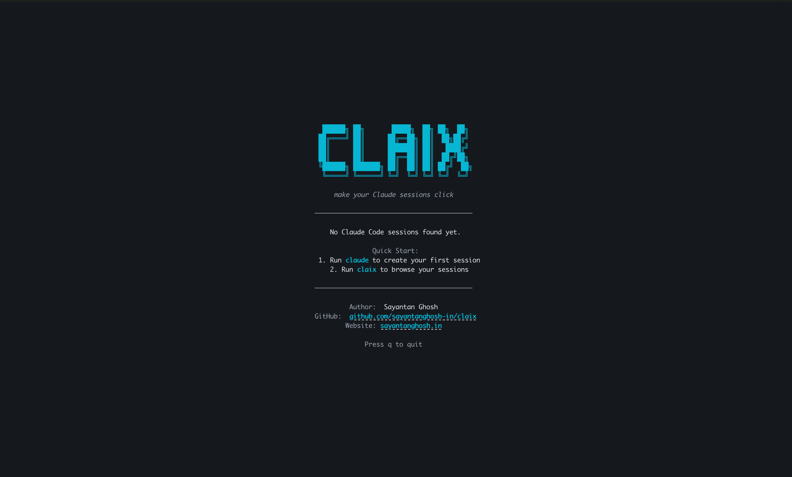

# Usage Guide

A comprehensive guide to using claix — the terminal UI for managing Claude Code sessions.

## Table of Contents

- [Interactive TUI](#interactive-tui)
- [Search](#search)
- [Tags & Notes](#tags--notes)
- [Session Init](#session-init)
- [CLI Commands](#cli-commands)
- [Stats](#stats)
- [Export](#export)
- [Themes](#themes)
- [Keyboard Shortcuts](#keyboard-shortcuts)
- [Star Nudge](#star-nudge)
- [MCP Integration](#mcp-integration)
- [Auto-Sync with Hooks](#auto-sync-with-hooks)
- [Troubleshooting](#troubleshooting)

---

## Interactive TUI

```bash
claix                            # Launch the full TUI
```

The TUI has a 2-column layout:

**Left column** — Dashboard header + scrollable session cards
- Session counts, 28-day activity sparkline, token usage, top projects
- Each session card shows: status, ID, project, branch, auto-title, file activity

**Right column** — Detail panel for the selected session
- Full metadata: project, branch, status, timestamps, message counts
- Clickable PR links (terminal hyperlinks — click to open in browser)
- File activity breakdown by repo
- Tags, notes, and conversation description
- Scroll with `←`/`→`


---

## Search

Press `/` in the TUI to search. Type your query and results filter in real-time across titles, branches, projects, and tags. Press `Esc` to clear, `Enter` to keep the filter.


---

## Tags & Notes

Press `t` to tag a session, `x` to remove a tag, `n` to add a note. Tags and notes are persisted locally and visible on both the session card and the detail panel.



---

## Session Init

Pre-tag a session before it starts:

```bash
claix init --title "Auth refactor" --tags "auth,backend"
```

Or run it interactively — it will prompt for a title and tags, then automatically launch `claude`:

```bash
claix init
```

When the session ends and `claix sync` runs, the tags are applied to the newest session in your working directory.

---

## CLI Commands

```bash
claix                            # Launch TUI (default)
claix list                       # List all sessions as a table
claix search "auth bug"          # Fuzzy search across titles, branches, tags
claix resume                     # Interactive picker — choose from last 10 sessions
claix stats                      # Detailed usage stats
claix export <session-id>        # Export session as markdown (pipe to pbcopy!)
claix sync                       # Manually re-index sessions
claix init                       # Set title + tags before starting a Claude session
claix install                    # Set up Claude Code hooks
claix uninstall                  # Remove Claude Code hooks
claix theme [name]               # View or switch color themes
claix mcp-server                 # Run as MCP server (used by Claude Code)
claix version                    # Print version
```

---

## Stats

```bash
claix stats
```

Shows detailed usage statistics including session counts, message totals, token usage, and top projects.


---

## Export

```bash
# Export a session summary to clipboard
claix export c8a4f03f | pbcopy

# Export to a file
claix export c8a4f03f > session-summary.md
```

The export includes: session metadata, auto-title, conversation highlights (first 5 exchanges), files changed, and PR links.


---

## Themes

claix ships with 6 built-in color themes:

```bash
claix theme                      # Show current theme + preview all themes
claix theme dracula              # Switch to Dracula
claix theme catppuccin           # Switch to Catppuccin (Mocha)
claix theme nord                 # Switch to Nord
claix theme gruvbox              # Switch to Gruvbox
claix theme tokyonight           # Switch to Tokyo Night
claix theme default              # Switch back to default
```


Your theme choice is saved to `~/.config/claix/store.json` and applied every time you launch `claix`.

---

## Keyboard Shortcuts

| Key | Action |
|-----|--------|
| `↑` / `k` | Move up |
| `↓` / `j` | Move down |
| `←` / `→` | Scroll detail panel |
| `Enter` | Resume selected session |
| `/` | Search / filter sessions |
| `t` | Add a tag to selected session |
| `x` | Remove a tag from selected session |
| `n` | Add a note to selected session |
| `s` | Star the repo on GitHub (when nudge is visible) |
| `d` | Dismiss star nudge for 10 days |
| `Esc` | Exit search / tag / note mode |
| `q` / `Ctrl+C` | Quit |

---

## Star Nudge

claix includes a periodic, dismissible nudge to star the repository on GitHub. It appears every 10 days and can be handled with two keys:

- **`s`** — Star the repo on GitHub (opens browser)
- **`d`** — Dismiss the nudge for 10 days

---

## MCP Integration

claix includes an MCP (Model Context Protocol) server so Claude Code can interact with your session data mid-conversation:

```bash
# Add to your Claude Code MCP settings (~/.claude/settings.json):
{
  "mcpServers": {
    "claix": { "command": "claix", "args": ["mcp-server"] }
  }
}
```

Available MCP tools:
- `claix_tag_session` — tag the current session
- `claix_note_session` — add a note to a session
- `claix_list_sessions` — list recent sessions
- `claix_session_info` — get full session details

---

## Auto-Sync with Hooks

After `claix install`, Claude Code runs `claix sync` every time a session ends. This rebuilds the session index at `~/.config/claix/index.json` so the TUI loads instantly.

To remove: `claix uninstall`

---

## Troubleshooting

### macOS: "cannot be opened because the developer cannot be verified"

If you installed via Homebrew tap or direct binary download, macOS Gatekeeper may block it. Fix with:

```bash
xattr -d com.apple.quarantine $(which claix)
```

This is not needed if you installed via `go install` (builds from source locally, no unsigned binary).

### Windows: SmartScreen warning

Windows SmartScreen may show a warning for unsigned binaries. Click "More info" then "Run anyway". This is not needed if you installed via `go install`.

> Both issues are caused by unsigned binaries. Code signing requires paid developer certificates. If you want to avoid these warnings entirely, use `go install github.com/sayantanghosh-in/claix@latest` which compiles from source on your machine.
